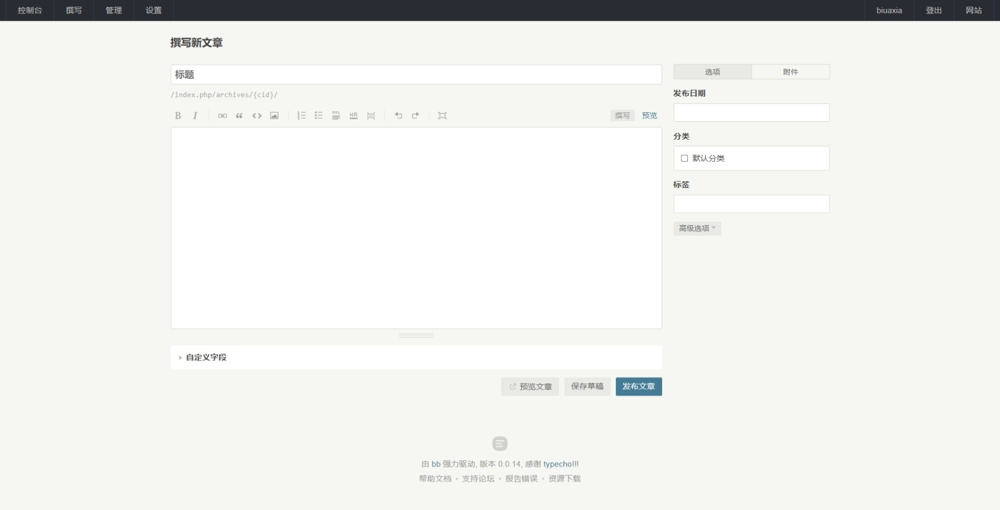

# bb

## 界面展示

---
首页

---
文章浏览

---
独立页面浏览

---
后台首页

---
仪表盘

---
管理文章

---
新建文章

---
编辑文章

---
管理页面

---
新建页面

---
编辑页面

## 发版说明

### 未安装 [goreleaser](https://goreleaser.com/install/)

1. `go install github.com/goreleaser/goreleaser@latest`
2. `goreleaser check`
3. `goreleaser release --snapshot --rm-dist`

### 已安装 [goreleaser](https://goreleaser.com/install/)

1. `goreleaser check`
2. `goreleaser release --snapshot --rm-dist`

## 待办事项

- 首页-最近回复
- 文章-添加评论
- 管理-评论
- 管理-分类
- 管理-标签
- 管理-文件
- 管理-用户
- 用户功能
- 归档功能
- 文章RSS
- 评论RSS

## 更新记录

### 0.0.15

- 前端侧边栏最新文章
- 独立页面新增、更新、删除（软删除）
- 前端浏览独立页面
- 前端独立页面选中样式
- 增加标题、描述配置
- 仪表盘输出配置文件具体内容

### 0.0.14

- 自动建表
- 文章新增、更新、删除(软删除)
- `archive/:id` 式路由适配
- markdown解析适配
- markdown编辑器原生支持
- 首页文章根据 `<!--more-->`标签进行分割
- 后台首页增加仪表盘功能（查看配置）
